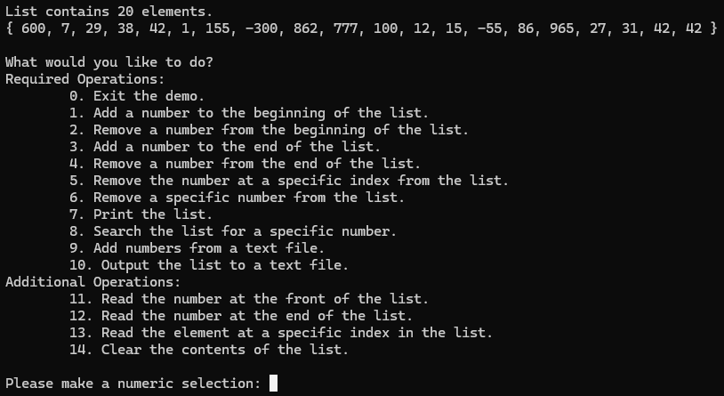

# C-Linked-List

Linked List in C for Study.com [Computer Science 111: Programming in C](https://study.com/academy/course/computer-science-111-programming-in-c.html#overview)

## Program Specifications

#### The program specifications listed here are publicly available at [Study.com](https://study.com/academy/lesson/programming-in-c-assignment-writing-a-user-defined-linked-list.html)

- Your program will implement a user-defined (defined by you) linked list.
- The minimum requirements of the linked list are:
	- Add or delete items at the beginning of the list (push and pop)
	- Remove items from the end of the list
	- Remove a specific item by index or by value
- The program will be interactive. At a minimum, the end-user will be able to print the list to the screen and add and delete values using the methods above.
- The user will be able to search the list for a particular value.
- The user will be able to input values using a text file and output the list to a text file.
- Functions are to be used where appropriate to produce readable, reusable code. Library functions and user-defined functions should be used where appropriate.

## Comments

The utterly insane amount of comments are required by the course rubric and are not reflective of my coding style.

## Demo Screenshots

## Building and Running

1. Clone the repository `git clone https://github.com/AustinBachurski/C-Linked-List.git`
1. Navigate to the project directory `cd C-Linked-List`
1. Set up a build directory `cmake -B build`
1. Build the application `cmake --build build`
1. Run the `linked_list` application from the `build/bin` directory.
	- Windows users may have to navigate to an additional `Debug` directory to access the executable.

## Additional Files

A `test_input.txt` file is included to simplify testing the `input values using a text file` requirement.

